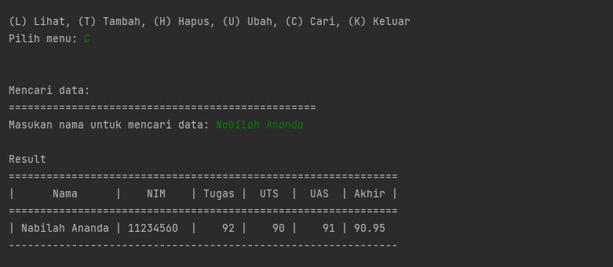

# Program1
### UAS Bahasa Pemrograman
```py
Nama  : Nabilah Ananda Putri
NIM   : 312110263
Kelas : TI.21.A.1
```
> ### Soal :
> Buatlah *package* dan modul dengan struktur sebagai berikut:
>
> 
>
> Kemudian buatlah file `README.md` yang berisi penjelasan dan *screenshot* hasil eksekusi program. Lalu upload ke *repository* github masing-masing.

- ### Struktur


> Penjelasan :

- Tambah Data
```py
def tambah_data():
    global data
    ulangi = 'y'
    while ulangi =='y':
        nama = input_nama()
        nim = input_nim()
        nilai_tugas = input_ntugas()
        nilai_uts = input_nuts()
        nilai_uas = input_nuas()
        nilai_akhir = nakhir()
        data[nama] = [nama, nim, nilai_tugas, nilai_uts, nilai_uas, nilai_akhir]
        ulangi = (input('tambah data?(y/t) : '))

        if ulangi == 't':
            print('\nData berhasil di tambah!')
            return data
```

- Output Tambah Data


- Lihat Data
```py
 model.daftar_nilai import data

def lihat_data():
    print("Daftar Nilai:")
    print("===================================================================")
    print("| No |      Nama      |    NIM    | Tugas |  UTS  |  UAS  | Akhir |")
    print("===================================================================")
    if data.keys():
        no = 1
        for tabel in data.values():
            print("| {0:2} | {1:14} | {2:9} | {3:5} | {4:5} | {5:5} | {6:5} |".format
                (no, tabel[0], tabel[1], tabel[2], tabel[3], tabel[4], tabel[5]))
            print('-------------------------------------------------------------------')
            no += 1
    else:
        print("=========================TIDAK ADA DATA============================")
        print("===================================================================")
```

- Output Lihat Data

  
- Cari Data
```py
def cari_data():
    print("Mencari data: ")
    print("=================================================")
    nama = input("Masukan nama untuk mencari data: ")
    print('\nResult')
    print("==============================================================")
    print("|      Nama      |    NIM    | Tugas |  UTS  |  UAS  | Akhir |")
    print("==============================================================")
    if nama in data.keys():
        print("| {0:14} | {1:9} | {2:5} | {3:5} | {4:5} | {5:5}"
            .format(nama, data[nama][1], data[nama][2], data[nama][3], data[nama][4], data[nama][5]))
        print('--------------------------------------------------------------')
    else:
        print("'{}' tidak ditemukan.".format(nama))
```

- Output Cari Data


- Ubah Data
```py
def ubah_data():
    nama = input("Masukan nama untuk mengubah data: ")
    if nama in data.keys():
        print("\nMau mengubah apa?")
        sub_data = input("(Semua), (NIM), (Tugas), (UTS), (UAS) : ")
        if sub_data.lower() == "semua":
            print("==========================")
            print("Ubah data {}.".format(nama))
            print("==========================")
            data[nama][1] = input("Ubah NIM:")
            data[nama][2] = int(input("Ubah Nilai Tugas: "))
            data[nama][3] = int(input("Ubah Nilai UTS: "))
            data[nama][4] = int(input("Ubah Nilai UAS: "))
            data[nama][5] = data[nama][2] *30/100 + data[nama][3]*35/100 + data[nama][4] *35/100
            print("\nBerhasil ubah data!")

        elif sub_data.lower() == "nim":
            data[nama][1] = input("\nNIM:")
            print('\nData berhasil di ubah!')
        elif sub_data.lower() == "tugas":
            data[nama][2] = int(input("\nNilai Tugas: "))
            data[nama][5] = data[nama][2] *30/100 + data[nama][3]*35/100 + data[nama][4] *35/100
            print('\nData berhasil di ubah!')
        elif sub_data.lower() == "uts":
            data[nama][3] = int(input("\nNilai UTS: "))
            data[nama][5] = data[nama][2] *30/100 + data[nama][3]*35/100 + data[nama][4] *35/100
            print('\nData berhasil di ubah!')
        elif sub_data.lower() == "uas":
            data[nama][4] = int(input("\nNilai UAS: "))
            data[nama][5] = data[nama][2] *30/100 + data[nama][3]*35/100 + data[nama][4] *35/100
            print('\nData berhasil di ubah!')
        else:
            print("\nmenu tidak ditemukan.")

    else:
        print("'{}' tidak ditemukan.".format(nama))

```

- Output Ubah Data


- Ouput Setelah Ubah Data


- Hapus Data
```py
def hapus_data():
    nama = input("Masukan nama untuk menghapus data : ")
    if nama in data.keys():
        del data[nama]
        print("\nData '{}' berhasil dihapus.".format(nama))
    else:
        print("'{}' tidak ditemukan.".format(nama))
```

- Output Hapus Data


- File `main.py`
```py
from model.daftar_nilai import *
from view.view_nilai import *

#Mulai
print("===============================================================")
print("|                           Program 1                         |")
print("===============================================================")

while True:
    print("\n")
    menu = input("(L) Lihat, (T) Tambah, (H) Hapus, (U) Ubah, (C) Cari, (K) Keluar\nPilih menu: ")
    print("\n")

    # menu
    if menu.lower() == 't':
        tambah_data()

    elif menu.lower() == 'c':
        cari_data()

    elif menu.lower() == 'l':
        lihat_data()

    elif menu.lower() == 'u':
        ubah_data()

    elif menu.lower() == 'h':
        hapus_data()

    # Keluar
    elif menu.lower() == 'k':
        break

    else:
        print("Upss ada yang salah, silahkan cek kembali.")
```

- Output Keluar
